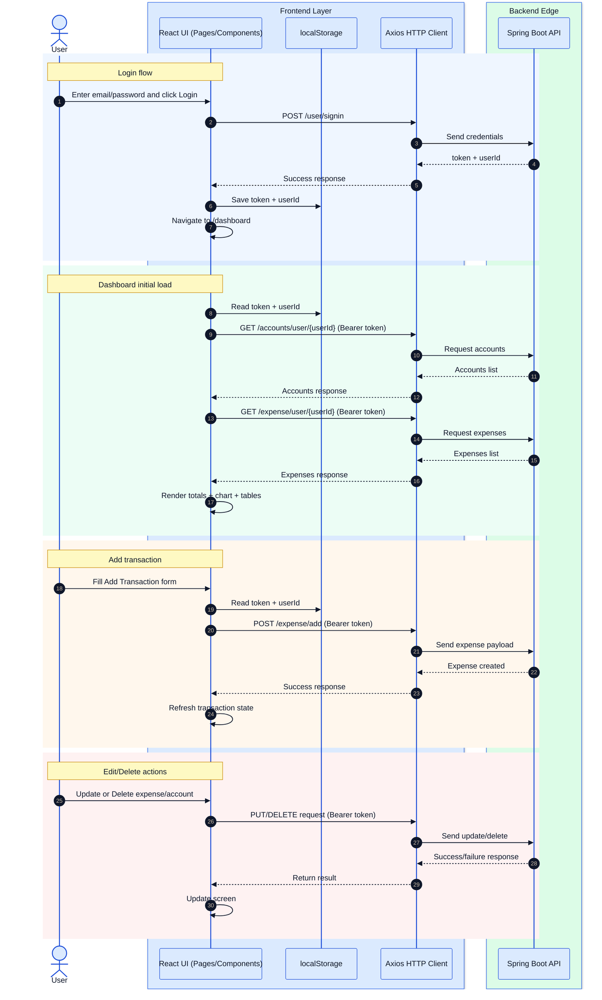

# React Sequence Diagram (Frontend)

```mermaid
%%{init: {'theme':'base','themeVariables':{
'fontFamily':'Trebuchet MS, Verdana, sans-serif',
'primaryColor':'#E8F1FF',
'primaryTextColor':'#0F172A',
'primaryBorderColor':'#2563EB',
'lineColor':'#334155',
'secondaryColor':'#ECFDF5',
'tertiaryColor':'#FFF7ED',
'actorBkg':'#DBEAFE',
'actorBorder':'#1D4ED8',
'actorTextColor':'#0F172A',
'signalColor':'#0F172A',
'signalTextColor':'#0F172A',
'labelBoxBkgColor':'#F8FAFC',
'labelBoxBorderColor':'#94A3B8',
'noteBkgColor':'#FEF9C3',
'noteBorderColor':'#CA8A04',
'noteTextColor':'#111827'
}}}%%
sequenceDiagram
    autonumber
    actor U as User

    box rgb(219, 234, 254) Frontend Layer
    participant UI as React UI (Pages/Components)
    participant LS as localStorage
    participant API as Axios HTTP Client
    end

    box rgb(220, 252, 231) Backend Edge
    participant BE as Spring Boot API
    end

    rect rgb(239, 246, 255)
    Note over U,UI: Login flow
    U->>UI: Enter email/password and click Login
    UI->>API: POST /user/signin
    API->>BE: Send credentials
    BE-->>API: token + userId
    API-->>UI: Success response
    UI->>LS: Save token + userId
    UI->>UI: Navigate to /dashboard
    end

    rect rgb(236, 253, 245)
    Note over U,UI: Dashboard initial load
    UI->>LS: Read token + userId
    UI->>API: GET /accounts/user/{userId} (Bearer token)
    API->>BE: Request accounts
    BE-->>API: Accounts list
    API-->>UI: Accounts response
    UI->>API: GET /expense/user/{userId} (Bearer token)
    API->>BE: Request expenses
    BE-->>API: Expenses list
    API-->>UI: Expenses response
    UI->>UI: Render totals + chart + tables
    end

    rect rgb(255, 247, 237)
    Note over U,UI: Add transaction
    U->>UI: Fill Add Transaction form
    UI->>LS: Read token + userId
    UI->>API: POST /expense/add (Bearer token)
    API->>BE: Send expense payload
    BE-->>API: Expense created
    API-->>UI: Success response
    UI->>UI: Refresh transaction state
    end

    rect rgb(254, 242, 242)
    Note over U,UI: Edit/Delete actions
    U->>UI: Update or Delete expense/account
    UI->>API: PUT/DELETE request (Bearer token)
    API->>BE: Send update/delete
    BE-->>API: Success/failure response
    API-->>UI: Return result
    UI->>UI: Update screen
    end
```
