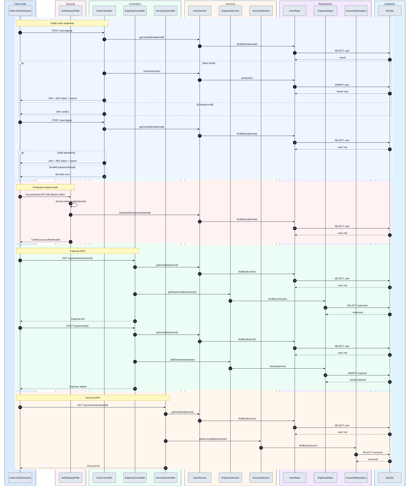

# Spring Boot Sequence Diagram (Backend)

```mermaid
%%{init: {'theme':'base','themeVariables':{
'fontFamily':'Trebuchet MS, Verdana, sans-serif',
'primaryColor':'#F1F5F9',
'primaryTextColor':'#0F172A',
'primaryBorderColor':'#334155',
'lineColor':'#334155',
'secondaryColor':'#EFF6FF',
'tertiaryColor':'#ECFDF5',
'actorBkg':'#E2E8F0',
'actorBorder':'#475569',
'actorTextColor':'#0F172A',
'signalColor':'#0F172A',
'signalTextColor':'#0F172A',
'labelBoxBkgColor':'#F8FAFC',
'labelBoxBorderColor':'#94A3B8',
'noteBkgColor':'#FEF9C3',
'noteBorderColor':'#CA8A04',
'noteTextColor':'#111827'
}}}%%
sequenceDiagram
    autonumber

    box rgb(219, 234, 254) Client Side
    participant C as Client (React/Axios)
    end

    box rgb(254, 242, 242) Security
    participant F as JwtRequestFilter
    end

    box rgb(236, 253, 245) Controllers
    participant UC as UserController
    participant EC as ExpenseController
    participant AC as AccountController
    end

    box rgb(255, 247, 237) Services
    participant US as UserService
    participant ES as ExpenseService
    participant AS as AccountService
    end

    box rgb(243, 232, 255) Repositories
    participant UR as UserRepo
    participant ER as ExpenseRepo
    participant AR as AccountRepository
    end

    box rgb(224, 242, 254) Database
    participant DB as MySQL
    end

    rect rgb(239, 246, 255)
    Note over C,UC: Public auth endpoints
    C->>UC: POST /user/signup
    UC->>US: getUserByEmail(email)
    US->>UR: findByEmail(email)
    UR->>DB: SELECT user
    DB-->>UR: result
    alt New email
        UC->>US: saveUser(user)
        US->>UR: save(user)
        UR->>DB: INSERT user
        DB-->>UR: saved user
        UC-->>C: 200 + JWT token + userId
    else Existing email
        UC-->>C: 409 conflict
    end

    C->>UC: POST /user/signin
    UC->>US: getUserByEmail(email)
    US->>UR: findByEmail(email)
    UR->>DB: SELECT user
    DB-->>UR: user row
    alt Valid password
        UC-->>C: 200 + JWT token + userId
    else Invalid password/email
        UC-->>C: 401/404 error
    end
    end

    rect rgb(254, 242, 242)
    Note over C,F: Protected request path
    C->>F: Any protected API with Bearer token
    F->>F: Extract token subject(email)
    F->>US: loadUserByUsername(email)
    US->>UR: findByEmail(email)
    UR->>DB: SELECT user
    DB-->>UR: user row
    F-->>C: Continue as authenticated
    end

    rect rgb(236, 253, 245)
    Note over C,EC: Expense APIs
    C->>EC: GET /expense/user/{userId}
    EC->>US: getUserById(userId)
    US->>UR: findById(userId)
    UR->>DB: SELECT user
    DB-->>UR: user row
    EC->>ES: getExpensesByUser(user)
    ES->>ER: findByUser(user)
    ER->>DB: SELECT expenses
    DB-->>ER: expenses
    EC-->>C: Expense list

    C->>EC: POST /expense/add
    EC->>US: getUserById(userId)
    US->>UR: findById(userId)
    UR->>DB: SELECT user
    DB-->>UR: user row
    EC->>ES: addExpense(expense)
    ES->>ER: save(expense)
    ER->>DB: INSERT expense
    DB-->>ER: saved expense
    EC-->>C: Expense added
    end

    rect rgb(255, 247, 237)
    Note over C,AC: Account APIs
    C->>AC: GET /accounts/user/{userId}
    AC->>US: getUserById(userId)
    US->>UR: findById(userId)
    UR->>DB: SELECT user
    DB-->>UR: user row
    AC->>AS: getAccountsByUser(user)
    AS->>AR: findByUser(user)
    AR->>DB: SELECT accounts
    DB-->>AR: accounts
    AC-->>C: Account list
    end
```
